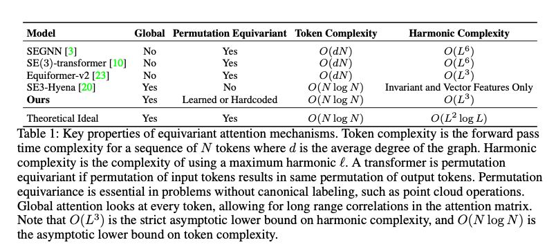

# CG transform

This repository is the implementation of CG-transformer idea, along with pretty comprehensive benchmarking of equivariant message passing and equivariant transformers.
The goal is to develop an equivariant transformer model that is asymptotically optimal in token and max harmonic, permutation equivariant and can easily learn robust representations across a wide variety of tasks namely computer vision, biochemistry and physics.

As a large scale use case, we will train this model for protein folding (compute request submitted), hopefully from scratch but probably with distillation.





This is an extension of SE(3)-Hyena method. No open source code for SE(3)-Hyena exists. 
We believe we have correctly reproduced their code, with some ambiguity into actually layer dimensions used.

### SE(3)-Hyena
The SE(3)-Hyena Operator adapts the Hyena architecture to 3D transformations by leveraging the mathematical properties of the special Euclidean group, SE(3). This operator enables a more efficient handling of 3D data, making it suitable for applications such as robotics, 3D object recognition, and physical simulations. The original paper can be founder here:

@misc{moskalev2024se3hyenaoperatorscalableequivariant,
      title={SE(3)-Hyena Operator for Scalable Equivariant Learning}, 
      author={Anonymous Authors},
      year={2024},
      eprint={2407.01049},
      archivePrefix={arXiv},
      primaryClass={cs.LG},
      url={https://arxiv.org/abs/2407.01049}, 
}

---
### Installation
To install CG-transformer, clone the repo:

```bash
cd CG_transformer

# Install dependencies
conda env create -f environment.yml
```

To check the installation, run:
```bash
python3 -m pytest tests
```

We benchmark against many standard baselines. Please install these from source:

### Install GATr
```bash
git clone https://github.com/Qualcomm-AI-research/geometric-algebra-transformer
cd GATr
pip install -e .
```
### Install SE(3)-Transformer
```bash
git clone https://github.com/FabianFuchsML/se3-transformer-public.git
cd se3-transformer-public
pip install -e .
```


---
### Benchmarks

SE(3)-Hyena can be tested on a few benchmarks:

1. Equivariant Associative Recall
2. QM-drugs
3. N-body dynamics
4. ModelNet40 Classification

Full details can be found in the learning_benchmarks dir.

### N-body dynamics
To generate a dataset run
```bash
python3 learning_benchmarks/nbody/nbody_data_generation/generate_dataset.py --num-train 30000 --num-test 5000 --n-balls 20
```
To check that data setup is correct, run
```bash
python3 -m pytest learning_benchmarks/nbody/nbody_tests
```


To train an SE(3)-Hyena transformer on the nbody dataset, run
```bash
python3 learning_benchmarks/nbody/nbody_run.py --savedir (path to data)
```
To evaluate the trained model, run
```bash
python3 learning_benchmarks/nbody/nbody_eval.py --savedir (path to data) --model (path to model)
```


### QM-drugs
Download the QM9 dataset with
```bash
cd learning_benchmarks/qm9
python download.py
```

To run the model on QM9,
```bash
python qm9_train.py --savedir (path to dataset)
```

### ModelNet
```bash
chmod +x run_se3hyena.sh
./run_se3hyena.sh
```
